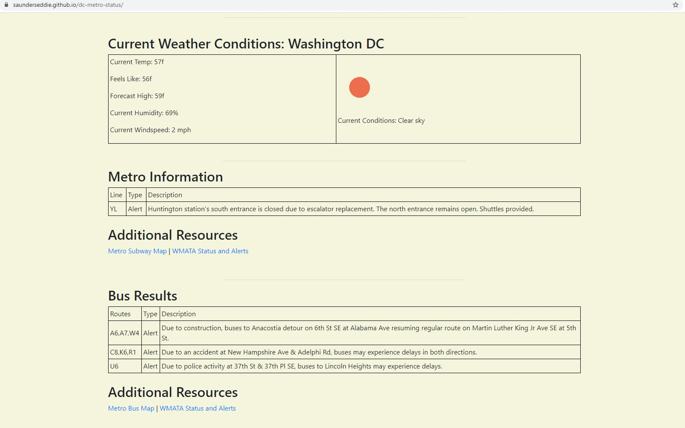

<h1 align ="center"> DC Metro Status </h1>
 
 ## Table of Contents

- About
- Use
- Future
- Technolgoy
- Credits

## About

The DC Metro Status page was created just as a fun JQuery page. We use JQuery to call the DC Metro system to get bus and subway status, along with a call to openWeatherMap to get current weather conditions.
The API keys being used for Metro and Weather are free public domain keys, they are use restricted resulting in the odd chance no data is returned as the use limit has been exceeded.
The page colour scheme is based upon the Washington DC flag.

## Use

The site can be accessed here:  
https://saunderseddie.github.io/dc-metro-status/

## Future

I may expand this in future to create an interactive site using an SPA framework such as React or Vue. As it stands now it does what it was intended to do using public API keys.

## Technology

The following technologies were used for this project:

- JQuery
- HTML
- CSS

## Credits

All development was performed by Eddie Saunders.

[Website](https://saunderseddie.github.io/dc-metro-status/) • [Facebook](https://www.facebook.com) • [Contact Me](mailto:edwyn.saunders@outlook.com)
